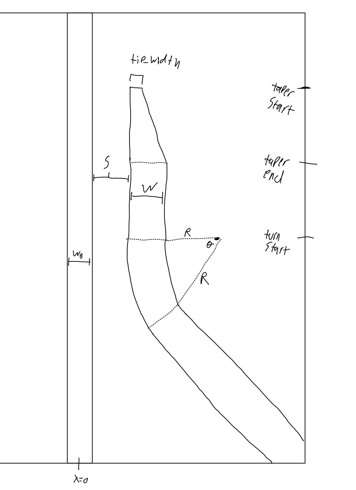

# ece4370_final_project
 
Adapted from the matlab code provided by Professor Karan Mehta, which was originally written by Carl Poitras. 

## Initializing the index distribution
Initialize the distribution using the setup_parameters.txt. This has the parameters:
- nCladding: cladding index
- nCore: core (effective) index
- lambd: wavelength (um)
- widthDomain: width of total thing simulating (um)
- lengthDomain: length of total thing simulating (um)
- w_B: width of the bus waveguide (um)
- s: separation between the two waveguides (um)
- w: width of the output waveguide (um)
- taper_start: top of the taper for the output waveguide (um)
- taper_end: bottom point of the taper for the output waveguide (um)
- turn_start: startpoint for where the output waveguide turns
- R: radius of the curve (um)
- angle: angle the output waveguide curves to (degrees)
- tip_width: the width of the tip of the taper of the output waveguide (um)
- sig: width of the initial amplitude distribution (um)
- del_x: discritization in x (um)
- del_z: discritization in z (um)
- alpha: mix between the two methods of simulation

An image showing how some of these parameters map onto the structure can be seen below. 0 x is in the middle, 0 z is the top edge. 

## Using the simulation code
After initialization, the code can be run either in python or c. C is much faster, but it requires using additional python code to plot the results afterwards. The python and C code have slight differences in the output results, but this appears to be due to some rounding in some built in functions, such as sin. 

### Using the Python code
The python code is good to immediatly visualize the structure, but it will be slow if you are trying to sweep over many different parameter variations. Simply call
`python project_sim.py` and then analyze the graphs.

### Using the C code
This code is faster but more complicated to modify if you are not familiar with C. First you should compile the code for your machine. Compile with optimizations by running:
`gcc -O3 -o project_sim_2d_c project_sim_2d.c`
Next run the code, specifying a target parameter file and optionally a target output file. If no output file is specified it will save to "project_sim_output.csv"
`./project_sim_2d_c <parameters file> <output file>`
Next analyze the results by putting your output file as the "file" parameter in plot_from_c_output.py and calling:
`python plot_from_c_output.py`

